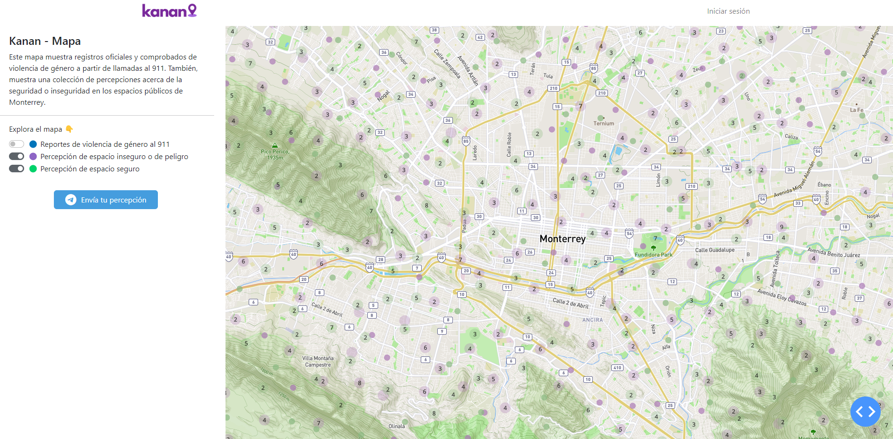

## Kanan - Perceptions map

A map that visualizes unsafe places for women that walk in the streets of Monterrey, Mexico.

The map has 3 layers:
- "Reportes de violencia de género al 911" = 911 gender violence reports
- "Percepción de espacio inseguro de peligro" = Locations with a perception of insecurity or real danger
- "Percepción de espacio seguro" = Location with a perception of security

Built using the framework Dash (Plotly) in Python.
